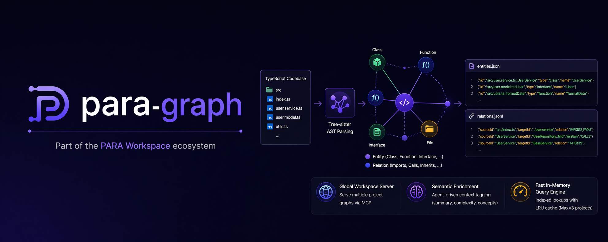

<div align="center">
  
  <br/>
  
  <h1>para-graph 🧠</h1>

  <p><b>Structural code analysis tool powered by Tree-sitter AST parsing.</b></p>

  <p>
    <a href="README.md"><b>🇺🇸 English</b></a>
  </p>

  <p>
    <a href="LICENSE"></a>
    
    = 18">
    
  </p>
</div>

<br/>

## Table of Contents

- [Overview](#overview)
- [Features](#features)
- [Quick Start](#quick-start)
- [Usage](#usage)
- [Output Format](#output-format)
- [Architecture](#architecture)
- [Development](#development)
- [Roadmap](#roadmap)
- [License](#license)

## 🎯 Overview

**para-graph** is a deterministic code analysis tool that extracts structural information from multi-language codebases and produces a knowledge graph in JSONL format.

It uses [Tree-sitter](https://tree-sitter.github.io/tree-sitter/) for fast, accurate AST parsing — no compiler pipeline required. The output graph captures:

- **Entities** — classes, functions, interfaces, arrow functions, methods
- **Relationships** — imports, function calls, inheritance (future)

Part of the [PARA Workspace](https://github.com/pageel/para-workspace) ecosystem.

## ✨ Features

- **Multi-Language Support** — TypeScript, TSX, Python 🐍, Bash 🐚, Go 🐹, PHP 🐘
- **Deterministic parsing** — Tree-sitter AST & Pure SSEC Queries, no LLM heuristics
- **JSONL output** — one entity/relation per line, easy to stream and process
- **Global Workspace Server** — Serve multiple project graphs simultaneously via MCP
- **Semantic Enrichment** — Agent-driven context tagging (summary, complexity, domain concepts)
- **Fast In-Memory Query Engine** — Indexed lookups with LRU cache (Max=3 projects)

## 🚀 Quick Start

```bash
# Clone
git clone https://github.com/pageel/para-graph.git
cd para-graph

# Install
npm install

# Build
npm run build

# Scan any supported project
npx para-graph build /path/to/your/ts/project ./output
```

Or run directly without cloning:

```bash
npx para-graph build ./src ./output
```

## 📖 Usage

### CLI Commands

```bash
# Scan source code and export graph
para-graph build <target-dir> [output-dir] [--import]

# Start MCP server for AI Agent integration
para-graph serve <workspace-root>

# Show help
para-graph --help
```

### Build Command

```bash
# Basic usage
para-graph build ./src                       # Output to ./output/
para-graph build ./src ./my-graph            # Custom output directory
para-graph build ./src ./out --import        # Preserve semantic data on re-scan
```

| Argument | Required | Default | Description |
|:--|:--|:--|:--|
| `target-dir` | ✅ | — | Directory containing supported source files |
| `output-dir` | — | `./output` | Where to write the graph output |
| `--import` | — | — | Load existing graph, preserve semantic enrichment data |

### Serve Command

```bash
# Start MCP server (stdio transport)
para-graph serve /path/to/workspace
```

### Library Usage

```typescript
// Import as a library
import { CodeGraph } from 'para-graph';

// Import MCP server factory
import { createServer } from 'para-graph/mcp';
```

## 📊 Output Format

Three files are generated in the output directory:

### `entities.jsonl`

One code entity per line, sorted by file path:

```json
{"id":"src/graph/code-graph.ts::CodeGraph","type":"class","name":"CodeGraph","filePath":"src/graph/code-graph.ts","startLine":10,"endLine":81,"exportType":"named","signature":"export class CodeGraph {"}
```

### `relations.jsonl`

One relationship per line, sorted by source file:

```json
{"sourceId":"src/index.ts","targetId":"./parser/file-walker.js","relation":"IMPORTS_FROM","sourceFile":"src/index.ts","sourceLine":3}
```

### `metadata.json`

Summary statistics:

```json
{
  "version": "0.1.0",
  "nodeCount": 31,
  "edgeCount": 47,
  "fileCount": 6,
  "createdAt": "2026-04-21T03:35:33.508Z"
}
```

### Entity Types

| Type | Description |
|:--|:--|
| `file` | Source file |
| `class` | Class declaration |
| `function` | Function, method, or arrow function |
| `interface` | Interface declaration |
| `variable` | Variable declaration (future) |

### Relation Types

| Relation | Description |
|:--|:--|
| `IMPORTS_FROM` | File imports from another module |
| `CALLS` | Function/method calls another function |
| `INHERITS` | Class extends another (future) |
| `IMPLEMENTS` | Class implements interface (future) |

## 🏗️ Architecture

```
src/
├── cli.ts                    # Subcommand router (shebang entrypoint)
├── commands/
│   ├── build.ts              # Build command — scan, parse, export graph
│   └── serve.ts              # Serve command — MCP server lifecycle
├── graph/
│   ├── models.ts             # GraphNode, GraphEdge type definitions
│   ├── code-graph.ts         # In-memory graph with dual indexing
│   ├── jsonl-exporter.ts     # Serialize graph → JSONL files
│   ├── jsonl-importer.ts     # Load graph from JSONL files
│   └── graph-store.ts        # LRU cache manager for multi-project graphs
├── mcp/
│   ├── server.ts             # MCP server factory (pure library export)
│   ├── tools.ts              # MCP tools: query, edges, enrich
│   └── resources.ts          # MCP resources: JSONL file access
├── parser/
│   ├── registry.ts           # Language Registry (lazy-loads parsers by extension)
│   ├── tree-sitter-parser.ts # AST parsing and SSEC mapping engine
│   └── file-walker.ts        # Recursive multi-language file scanner
└── queries/
    ├── typescript.scm        # SSEC query patterns for TS/TSX
    ├── python.scm            # SSEC query patterns for Python
    ├── go.scm                # SSEC query patterns for Go
    ├── php.scm               # SSEC query patterns for PHP
    └── bash.scm              # SSEC query patterns for Bash
```

### Data Flow

```
Source files → File Walker → Registry Lookup → Tree-sitter Parser + SSEC Query → CodeGraph (in-memory) → JSONL Export
                                                                                       │
                                                                                 GraphStore (LRU)
                                                                                       │
                                                                                 MCP Server → AI Agent
```

## 🛠️ Development

```bash
# Install dependencies
npm install

# Run in development
npm run dev

# Build TypeScript
npm run build

# Run tests
npm run test
```

### Tech Stack

| Component | Technology |
|:--|:--|
| Runtime | Node.js ≥ 18 |
| Language | TypeScript 5.x (strict mode) |
| AST Parser | tree-sitter + tree-sitter-typescript |
| Test Runner | Vitest |
| Dev Runner | tsx |

## 🗺️ Roadmap

| Phase | Description | Status |
|:--|:--|:--|
| P1 | Structural Base (Tree-sitter AST) | ✅ Done |
| P2 | Semantic Enrichment (Agent-Driven) | ✅ Done |
| P3 | Storage & Query Engine | ✅ Done |
| P4 | CLI Integration & NPM Package | ✅ Done |
| P5 | Multi-language Support & Query Refactor | ✅ Done |
| P6 | Impact & Context Queries | 📋 Planned |
| P7 | Deep CALLS + Pattern Detection | 📋 Planned |
| P8 | Documentation & Stable Release (v1.0.0) | 📋 Planned |

## 📄 License

[MIT](LICENSE)
