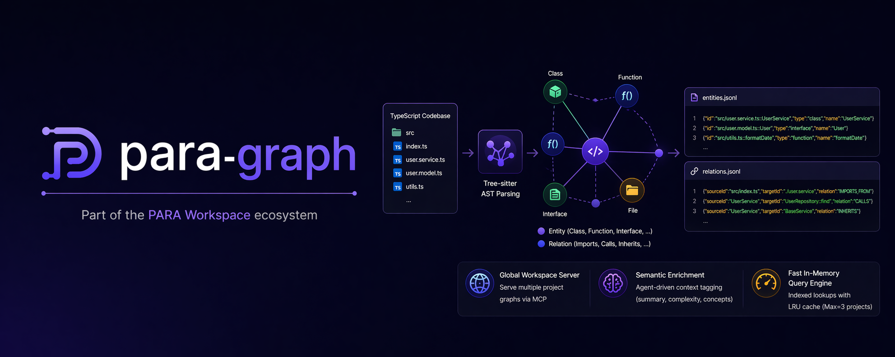

<div align="center">
  
  <br/>
  
  <h1>para-graph 🧠</h1>

  <p><b>Công cụ phân tích mã nguồn cấu trúc dựa trên Tree-sitter AST parsing.</b></p>

  <p>
    <a href="../../README.md"><b>🇺🇸 English</b></a> •
    <a href="vi-VN.md"><b>🇻🇳 Tiếng Việt</b></a>
  </p>

  <p>
    <a href="../../LICENSE"></a>
    
    = 18">
    
  </p>
</div>

<br/>

## Mục lục

- [Tổng quan](#tong-quan)
- [Tính năng](#tinh-nang)
- [Bắt đầu nhanh](#bat-dau-nhanh)
- [Hướng dẫn sử dụng](#huong-dan-su-dung)
- [Thiết lập MCP Server](#thiet-lap-mcp-server)
- [Định dạng đầu ra](#dinh-dang-dau-ra)
- [Kiến trúc](#kien-truc)
- [Phát triển](#phat-trien)
- [Trí tuệ Nhân tạo (PARA Workspace)](#tri-tue-nhan-tao)
- [Lộ trình](#lo-trinh)
- [Giấy phép](#giay-phep)

<a name="tong-quan"></a>
## 🎯 Tổng quan

**para-graph** là công cụ phân tích mã nguồn tất định (deterministic), dùng để trích xuất thông tin cấu trúc từ các dự án đa ngôn ngữ và tạo ra đồ thị tri thức (knowledge graph) dưới định dạng JSONL.

Công cụ sử dụng [Tree-sitter](https://tree-sitter.github.io/tree-sitter/) để phân tích AST nhanh và chính xác — không cần cài đặt luồng biên dịch (compiler pipeline). Đồ thị đầu ra ghi nhận:

- **Thực thể (Entities)** — classes, functions, interfaces, arrow functions, methods
- **Mối quan hệ (Relationships)** — imports, function calls, inheritance (dự kiến)

Đây là một thành phần của hệ sinh thái [PARA Workspace](https://github.com/pageel/para-workspace).

<a name="tinh-nang"></a>
## ✨ Tính năng

- **Hỗ trợ đa ngôn ngữ** — TypeScript, TSX, Python 🐍, Bash 🐚, Go 🐹, PHP 🐘
- **Trích xuất Deep CALLS** — Phân tích chính xác các chuỗi gọi hàm, ghép cặp object+method và constructor
- **Độ tin cậy của Mối quan hệ (Edge Confidence)** — Phân loại các cạnh đồ thị (`EXTRACTED`, `INFERRED`, `AMBIGUOUS`)
- **Nhận diện God Nodes** — Phân tích topology (`fanIn`/`fanOut`) để tìm các điểm thắt nút (choke points) trong kiến trúc
- **Phân tích tất định** — Tree-sitter AST & Pure SSEC Queries, không dùng LLM heuristics
- **Định dạng JSONL** — mỗi dòng một thực thể/mối quan hệ, dễ dàng stream và xử lý
- **Global Workspace Server** — Phục vụ đồng thời đồ thị của nhiều dự án qua MCP
- **Làm giàu ngữ nghĩa (Semantic Enrichment)** — Đặc tả ngữ nghĩa tự động bằng Agent (tóm tắt, độ phức tạp, domain concepts)
- **Truy vấn In-Memory tốc độ cao** — Tìm kiếm có chỉ mục với LRU cache (Tối đa = 3 dự án)
- **Phân tích tác động (Impact Analysis)** — Duyệt đồ thị theo chiều rộng (BFS) để tìm tất cả các node bị ảnh hưởng khi sửa code
- **Gói ngữ cảnh (Context Bundle)** — Lấy mã nguồn, nơi gọi, nơi được gọi, imports, và tests chỉ trong một lần gọi MCP
- **Agentic Edge Resolution** — Cho phép chèn các mối quan hệ còn thiếu (ví dụ: dynamic Bash imports) trực tiếp qua MCP
- **MCP Auto-Setup** — Manifest-declared `mcp:` block cho phép cấu hình tự động cho IDE qua lệnh `./para mcp-setup`
- **Ảnh cấu trúc tệp tin nguyên tử (v0.17.0+)** — Chụp ảnh cấu trúc cây thư mục mã nguồn dự án, băm mã SHA256 từng tệp tin vào SQLite để theo dõi phiên bản.
- **Bảo vệ tệp tin quan trọng (v0.17.0+)** — Quản lý danh sách tệp tin được bảo vệ và cảnh báo nếu phát hiện thiếu hụt tệp tin khi xác thực snapshot.
- **Nén bối cảnh phiên làm việc (v0.17.1+)** — Tự động quét và nén các tệp quy tắc, kỹ năng, và hợp đồng dự án của phiên hoạt động, ghi tóm tắt vào `vibecode_session/artifacts/session.md` để Agent khôi phục bối cảnh.
- **Tìm kiếm lai RRF (v0.17.1+)** — Tích hợp thuật toán Reciprocal Rank Fusion (RRF) để kết hợp kết quả khớp từ khóa FTS5 và tìm kiếm LIKE.
- **Truy xuất bối cảnh đa nguồn (v0.17.1+)** — Hỗ trợ thu thập callers, callees, imports, tests từ nhiều node ID (multi-seed) đồng thời, tự động loại bỏ trùng lặp và tỉa theo khoảng cách tô-pô (giới hạn 20 mỗi seed, 50 toàn cục).
- **Quản lý file rác theo Profile (v0.17.6.1+)** — Tự động nhận diện và phân loại các tệp tin rác không được theo dõi hoặc bị bỏ qua dựa trên các profile marker (Astro, TypeScript, CF Workers, Python, PHP) hoặc cấu hình dự án, chia thành 3 phân tầng an toàn để hỗ trợ dọn dẹp.

<a name="bat-dau-nhanh"></a>
## 🚀 Bắt đầu nhanh

> **Điều kiện tiên quyết:** Đảm bảo bạn đã cài đặt Node.js (>= 18.0.0) và `npm`.
> *Lưu ý: Thư viện `better-sqlite3` sẽ được tự động cài đặt động chỉ trên môi trường Node < 22 để bỏ qua bước biên dịch native C++ trên các phiên bản Node mới.*

```bash
# Clone
git clone https://github.com/pageel/para-graph.git
cd para-graph

# Cài đặt
npm install

# Build
npm run build

# Quét bất kỳ dự án nào được hỗ trợ
npx para-graph build /path/to/your/ts/project ./output
```

Hoặc chạy trực tiếp không cần clone:

```bash
npx para-graph build ./src ./output
```

<a name="huong-dan-su-dung"></a>
## 📖 Hướng dẫn sử dụng

### Lệnh CLI

```bash
# Quét mã nguồn theo tên dự án (tự động phát hiện workspace)
para-graph build <project-name>

# Quét mã nguồn và xuất đồ thị (đường dẫn thủ công)
para-graph build <target-dir> [output-dir] [--clean]

# Tiêm dữ liệu Đồ thị & Xác thực sự sai lệch (Drift) trong Markdown Docs/Plans
para-graph inject <target-dir>

# Chụp ảnh cấu trúc cây thư mục mã nguồn dự án
para-graph project-snapshot <project-name>

# So khớp khác biệt giữa hai bản chụp snapshot
para-graph project-diff <project-name> <src-snap-id> <tgt-snap-id>

# Khởi động MCP server để tích hợp AI Agent
para-graph serve [workspace-root]

# Quản lý BeforeTool hooks
para-graph hooks install
para-graph hooks uninstall
para-graph hooks status

# Xem trợ giúp
para-graph --help
```

### Lệnh Hooks

Lệnh `hooks` dùng để quản lý BeforeTool hooks, tự động nhắc nhở (nudge) AI Agent sử dụng Đồ thị Tri thức trước khi truy quét tập tin một cách mù quáng.

```bash
# Cài đặt hook vào ~/.gemini/settings.json
para-graph hooks install

# Kiểm tra trạng thái hook hiện tại
para-graph hooks status

# Gỡ bỏ hook và khôi phục cài đặt gốc
para-graph hooks uninstall
```

**Cách hoạt động:**
1. `para-graph build` tạo lập Đồ thị Tri thức.
2. `para-graph hooks install` tiêm BeforeTool hook vào cấu hình Gemini CLI.
3. Khi Agent truy cập file lần đầu, nó nhận được lời nhắc ngữ cảnh: _"Đã có Đồ thị Tri thức — hãy sử dụng các công cụ MCP trước"_.
4. Một file khóa (lock file) sẽ ngăn chặn việc nhắc đi nhắc lại trong cùng một phiên làm việc.
5. `para-graph build` tự động đặt lại (reset) khóa sau mỗi lần đồ thị cập nhật.

### Lệnh Build

```bash
# Sử dụng cơ bản
para-graph build my-project                  # Dạng rút gọn (khuyên dùng)
para-graph build ./src                       # Xuất ra ./output/
para-graph build ./src ./my-graph            # Tùy chỉnh thư mục xuất
para-graph build ./src ./out --clean        # Xóa đồ thị cũ, quét lại từ đầu
```

| Tham số | Bắt buộc | Mặc định | Mô tả |
|:--|:--|:--|:--|
| `project-name` | ✅ (hoặc target-dir) | — | Tên dự án trong workspace (tự động phân giải repo/ và .beads/graph/) |
| `target-dir` | ✅ (hoặc project-name) | — | Thư mục chứa mã nguồn được quét |
| `output-dir` | — | `./output` | Thư mục để ghi kết quả đồ thị |
| `--clean` | — | — | Không tải đồ thị có sẵn, xóa và quét lại từ đầu |

### Lệnh Serve

```bash
# Khởi động MCP server (stdio transport)
para-graph serve /path/to/workspace

# Hoặc tự động phát hiện thư mục gốc của workspace
para-graph serve
```

<a name="thiet-lap-mcp-server"></a>
## 🤖 Thiết lập MCP Server

Để kết nối `para-graph` với AI Agent editor (như Claude Desktop, Cursor, hay Google Antigravity), bạn cần cấu hình phần cài đặt MCP tương ứng.

### Cài đặt Tự động (Khuyên dùng)

Nếu bạn đang sử dụng PARA Workspace v1.8.2+, bạn có thể tự động hóa cấu hình MCP server cho IDE của mình bằng cách chạy:

```bash
./para mcp-setup
```

Hệ thống sẽ an toàn tự động nhận diện IDE đang hoạt động và tiêm cấu hình MCP server cho `para-graph`.

### Cài đặt Thủ công (Dự phòng)

Nếu bạn muốn cấu hình server theo cách thủ công:

#### Claude Desktop / Antigravity

Sửa file `claude_desktop_config.json` (hoặc `mcp_config.json` đối với Antigravity) và thêm phần sau:

```json
{
  "mcpServers": {
    "para-graph": {
      "command": "<ABSOLUTE_WORKSPACE_PATH>/cli/para",
      "args": [
        "graph",
        "serve",
        "<ABSOLUTE_WORKSPACE_PATH>"
      ]
    }
  }
}
```

*Lưu ý: Thay thế `<ABSOLUTE_WORKSPACE_PATH>` bằng đường dẫn tuyệt đối đến thư mục gốc của PARA Workspace của bạn.*

#### Cursor

Vào **Cursor Settings** > **Features** > **MCP Servers** > **Add New MCP Server**:
- **Name:** `para-graph`
- **Type:** `command`
- **Command:** `<ABSOLUTE_WORKSPACE_PATH>/cli/para graph serve <ABSOLUTE_WORKSPACE_PATH>`

### Các công cụ MCP có sẵn
Sau khi kết nối, AI Agent của bạn sẽ có quyền truy cập vào các công cụ sau:
- `graph_query`: Tìm kiếm các thực thể theo tên hoặc theo loại node trong đồ thị.
- `graph_edges`: Tìm tất cả mối quan hệ (cạnh) được kết nối đến/đi từ một node cụ thể.
- `graph_enrich`: Lưu trữ thông tin làm giàu ngữ nghĩa (tóm tắt, độ phức tạp, domain concepts, docAnchors) cho một node.
- `graph_impact_analysis`: Phân tích tác động khi sửa đổi thực thể code, trả về tất cả các node/file bị ảnh hưởng ngược dòng (upstream) hoặc xuôi dòng (downstream).
- `graph_context_bundle`: Lấy gói ngữ cảnh đầy đủ cho thực thể code (mã nguồn, callers, callees, imports, tests liên quan). Hỗ trợ danh sách đa nguồn (multi-seed).
- `graph_add_edges`: Thêm hàng loạt các mối quan hệ (CALLS, IMPORTS_FROM) vào đồ thị để giải quyết liên kết yếu đối với các ngôn ngữ có AST yếu (ví dụ: Bash).
- `graph_god_nodes`: Lấy các thực thể kết nối nhiều nhất trong đồ thị (God nodes) để ưu tiên làm giàu ngữ nghĩa trước.
- `graph_expand_node`: Chỉ lấy mã nguồn cho một thực thể code cụ thể với cơ chế kiểm tra giới hạn AST.
- `graph_link_docs`: Liên kết các file tài liệu Markdown vào các node tương ứng trên đồ thị dựa trên các thẻ neo (anchors).
- `insight_push`: Đẩy một bài học/nhận thức dự án (lesson, risk, decision, pattern, gotcha) vào cơ sở dữ liệu SQLite bền vững.
- `insight_search`: Tìm kiếm các bài học/nhận thức dự án bằng tìm kiếm toàn văn FTS5 cùng bộ lọc metadata.
- `insight_validate`: Cập nhật trạng thái vòng đời của một nhận thức dự án (hypothesis -> validated -> deprecated).
- `memory_push`: Gửi một sự kiện phiên làm việc (cuộc hội thoại, quyết định, lỗi phát sinh) vào kho lưu trữ MemoryStore của dự án.
- `memory_search`: Tìm kiếm toàn văn (FTS5) trên các sự kiện bộ nhớ đã lưu trữ bằng từ khóa.
- `memory_curate`: Gom cụm các sự kiện bộ nhớ thô thành các lát cắt ngữ nghĩa dựa trên phiên làm việc.
- `graph_audit_csa`: Chạy kiểm tra tuân thủ Kiến trúc Đặc tả Đồng quy (CSA) cho dự án.
- `graph_fix_csa`: Tự động sửa chữa các liên kết spec bị hỏng (thay thế thẻ neo spec bị trôi lệch trong mã nguồn).
- `project_snapshot`: Chụp ảnh cấu trúc thư mục dự án, ghi nhận metadata vào SQLite, và kiểm tra các tệp tin bảo vệ. Hỗ trợ phát hiện và phân loại file rác vật lý theo các profile hoạt động (`auditJunk: true`), trả về một mảng phẳng tương thích ngược và báo cáo chi tiết theo 3 phân tầng.
- `project_diff`: So khớp hai bản chụp snapshot để tìm ra các file thêm mới, bị xoá, hoặc bị chỉnh sửa (phát hiện sai lệch vật lý).
- `project_protected_files`: Liệt kê, thêm hoặc xoá các file thuộc danh sách bảo vệ của dự án.
- `project_session_compact`: Quét rules, skills, và project contract, rồi ghi tóm tắt bối cảnh tinh gọn để Agent khôi phục.
- `project_state_get`: Lấy siêu dữ liệu và số lượng task đã lưu cache từ SQLite. Kiểm tra tính tươi mới (freshness) đối với các file cấu hình thông qua mã hash MD5.
- `project_state_sync`: Đồng bộ và lưu cache siêu dữ liệu cũng như số lượng task từ các file cấu hình (`project.md`, `backlog.md`, `sprint-current.md`) vào cơ sở dữ liệu SQLite.

### Sử dụng như Thư viện

```typescript
// Import như một thư viện
import { CodeGraph } from 'para-graph';

// Import MCP server factory
import { createServer } from 'para-graph/mcp';
```

<a name="dinh-dang-dau-ra"></a>
## 📊 Định dạng đầu ra

Ba file được tạo ra trong thư mục kết quả:

### `entities.jsonl`

Mỗi dòng một thực thể code, sắp xếp theo đường dẫn file:

```json
{"id":"src/graph/code-graph.ts::CodeGraph","type":"class","name":"CodeGraph","filePath":"src/graph/code-graph.ts","startLine":10,"endLine":81,"exportType":"named","signature":"export class CodeGraph {"}
```

### `relations.jsonl`

Mỗi dòng một mối quan hệ, sắp xếp theo file nguồn:

```json
{"sourceId":"src/index.ts","targetId":"./parser/file-walker.js","relation":"IMPORTS_FROM","sourceFile":"src/index.ts","sourceLine":3}
```

### `metadata.json`

Thống kê tóm tắt:

```json
{
  "version": "0.1.0",
  "nodeCount": 31,
  "edgeCount": 47,
  "fileCount": 6,
  "createdAt": "2026-04-21T03:35:33.508Z"
}
```

### Các kiểu Thực thể (Entity Types)

| Kiểu | Mô tả |
|:--|:--|
| `file` | File mã nguồn |
| `class` | Khai báo lớp (Class) |
| `function` | Hàm, phương thức (method), hoặc arrow function |
| `interface` | Khai báo Interface |
| `variable` | Khai báo biến (dự kiến) |

### Các kiểu Mối quan hệ (Relation Types)

| Quan hệ | Mô tả |
|:--|:--|
| `IMPORTS_FROM` | File import từ một module khác |
| `CALLS` | Hàm/phương thức gọi một hàm khác |
| `INHERITS` | Class kế thừa từ một class khác (dự kiến) |
| `IMPLEMENTS` | Class thực thi interface (dự kiến) |

<a name="kien-truc"></a>
## 🏗️ Kiến trúc

```
src/
├── cli.ts                    # Trình định tuyến lệnh phụ (shebang entrypoint)
├── commands/
│   ├── build.ts              # Lệnh build — quét, parse, xuất đồ thị
│   └── serve.ts              # Lệnh serve — vòng đời MCP server
├── graph/
│   ├── models.ts             # Định nghĩa kiểu GraphNode, GraphEdge
│   ├── code-graph.ts         # Đồ thị In-memory với chỉ mục kép
│   ├── jsonl-exporter.ts     # Serialize đồ thị → JSONL files
│   ├── jsonl-importer.ts     # Load đồ thị từ JSONL files
│   └── graph-store.ts        # Quản lý LRU cache cho đa dự án
├── mcp/
│   ├── server.ts             # MCP server factory (pure library export)
│   ├── tools.ts              # Công cụ MCP: query, edges, enrich, impact_analysis...
│   └── resources.ts          # Tài nguyên MCP: Truy cập file JSONL
├── parser/
│   ├── registry.ts           # Đăng ký Ngôn ngữ (lazy-loads parser theo đuôi file)
│   ├── tree-sitter-parser.ts # Động cơ phân tích AST và ánh xạ SSEC
│   └── file-walker.ts        # Trình quét file đệ quy đa ngôn ngữ
└── queries/
    ├── typescript.scm        # Mẫu truy vấn SSEC cho TS/TSX
    ├── python.scm            # Mẫu truy vấn SSEC cho Python
    ├── go.scm                # Mẫu truy vấn SSEC cho Go
    ├── php.scm               # Mẫu truy vấn SSEC cho PHP
    └── bash.scm              # Mẫu truy vấn SSEC cho Bash
```

### Luồng Dữ liệu (Data Flow)

```
File mã nguồn → File Walker → Đăng ký Ngôn ngữ → Trình phân tích Tree-sitter + SSEC Query → CodeGraph (in-memory) → Xuất JSONL
                                                                                        │
                                                                                  GraphStore (LRU)
                                                                                        │
                                                                                  MCP Server → AI Agent
```

### Cấu trúc Thư mục & Tích hợp sau khi Cài đặt

Khi người dùng chạy lệnh `./para install-tool para-graph`, công cụ được cài đặt và phân phối các cấu phần vào 4 khu vực khác nhau trong Workspace:

```
workspace-root/
├── .para/tools/graph/              # [Khu vực A] Nhân công cụ (Engine Core)
│   ├── dist/                       # Mã chạy JavaScript biên dịch sẵn
│   │   ├── cli.js                  # CLI Router chính
│   │   └── mcp/server.js           # Nhân MCP Server
│   ├── package.json                # Khai báo dependency và phiên bản
│   ├── tool.manifest.yml           # Manifest khai báo các agent assets cần cài đặt
│   └── install-hooks.sh            # Post-install hook tự động chạy sau khi cài
│
├── Resources/references/para-workspace/cli/commands/graph.sh  # [Khu vực B] CLI Wrapper lệnh shell (hoặc Projects/para-workspace/repo/... nếu ở chế độ dev)
│
├── .agents/                        # [Khu vực C] Agent Intelligence (shipped từ tool)
│   ├── workflows/para-graph.md     # Workflow vận hành đồ thị
│   ├── skills/para-graph/          # Skill của AI Agent tương tác với đồ thị
│   ├── skills/csa/                 # Skill CSA audit
│   ├── rules/graph-first-policy.md # Luật bắt buộc sử dụng đồ thị
│   └── rules/csa-compliance.md     # Luật bắt buộc sử dụng CSA double-binding
│
└── ~/.gemini/antigravity-ide/knowledge/  # [Khu vực D] Knowledge Items (IDE Context Store)
    ├── para_graph_architecture/    # Tài liệu kiến trúc cho AI đọc
    ├── para_graph_mcp_tools/       # Hướng dẫn sử dụng MCP tools
    └── para_graph_workflows/       # Danh mục lệnh CLI
```

#### Chi tiết các Khu vực Cài đặt

* **A. Nhân công cụ (Engine Core) — `.para/tools/graph/`**: Đây là thư mục chứa mã chạy thực tế của công cụ.
  * **Không chứa mã nguồn gốc (`src/`)**: Toàn bộ mã nguồn TypeScript đã được compile sẵn thành JavaScript và đặt trong `dist/` để chạy ngay mà không cần cài trình biên dịch.
  * **`install-hooks.sh`**: Đoạn mã Bash tự động chạy sau khi cài đặt xong để cài đặt production dependencies, đồng bộ Knowledge Items và đăng ký MCP Server vào cấu hình IDE.
* **B. CLI Wrapper — `cli/commands/graph.sh`**: Sourced bởi CLI chính. Trên môi trường production của người dùng cuối, file wrapper này được tự động tạo tại `Resources/references/para-workspace/cli/commands/graph.sh`. Đối với môi trường phát triển (profile dev hoạt động), nó sẽ cài đặt vào `Projects/para-workspace/repo/cli/commands/graph.sh`. Khi người dùng chạy `./para graph build ...`, wrapper này sẽ thực thi: `node .para/tools/graph/dist/cli.js build ...`.
* **C. Agent Intelligence — `.agents/`**: Trình cài đặt phân tích file `tool.manifest.yml` và sao chép các file template agent assets từ tool vào thư mục `.agents/` của workspace (workflows, skills, rules) để định hình và mở rộng khả năng cho AI Agent.
* **D. Knowledge Items (KI Store) — `~/.gemini/.../knowledge/`**: Các tài liệu lý thuyết, kiến trúc dạng Markdown được đồng bộ từ thư mục `templates/knowledge/` của công cụ sang thư mục Knowledge cục bộ của IDE. Giúp AI Agent ngay lập tức có tri thức vận hành đồ thị.

<a name="phat-trien"></a>
## 🛠️ Phát triển

```bash
# Cài đặt thư viện
npm install

# Chạy môi trường phát triển
npm run dev

# Biên dịch TypeScript
npm run build

# Chạy test
npm run test
```

### Công nghệ sử dụng (Tech Stack)

| Thành phần | Công nghệ |
|:--|:--|
| Runtime | Node.js ≥ 18 |
| Ngôn ngữ | TypeScript 5.x (strict mode) |
| Phân tích AST | tree-sitter + tree-sitter-typescript |
| Test Runner | Vitest |
| Dev Runner | tsx |

<a name="tri-tue-nhan-tao"></a>
## 🧠 Trí tuệ Nhân tạo (PARA Workspace)

Công cụ này đi kèm với các artifact trí tuệ nhân tạo nhằm nâng cao trải nghiệm làm việc với Agent trên hệ sinh thái PARA Workspace. Khi bạn cài đặt qua lệnh `./para install-tool para-graph`, các artifact này sẽ được cài đặt tự động vào thư mục `.agents/` của workspace:

| Loại | Tên | Phiên bản | Mô tả & Cách dùng |
|:--|:--|:--|:--|
| Workflow | `/para-graph` | 2.0.1 | Gõ `@[/para-graph]` để chỉ thị cho AI quét lại dự án và cập nhật trí nhớ đồ thị. |
| Skill | `para-graph` | 2.5.0 | Bộ định tuyến Trí tuệ Đồ thị tập trung (Centralized Graph Intelligence Router). Được tự động nạp cho các workflow như `/plan`, `/docs`, `/brainstorm` nhằm phân tích ngữ nghĩa và xác thực kiến trúc. |
| Skill | `csa` | 1.1.0 | Skill Kiến trúc Đặc tả Đồng quy (Convergent Specification Architecture) toàn cục dùng để kiểm tra tính tuân thủ và cổng chất lượng tài liệu trên toàn workspace. |
| Rule | `graph-first-policy` | 1.1.0 | Bắt buộc thực hiện lập trình kiểu "đồ thị là trên hết". Agent sẽ tự động truy vấn MCP server trước khi ra quyết định kiến trúc. |
| Knowledge Item | `para_graph_architecture` | — | Mô tả kiến trúc cốt lõi của đồ thị lai mã nguồn - tri thức, lược đồ thực thể/mối quan hệ, và sơ đồ thư mục trong `.beads/graph/`. |
| Knowledge Item | `para_graph_mcp_tools` | — | Hướng dẫn chi tiết cách sử dụng các công cụ MCP (`graph_query`, `graph_context_bundle`, v.v.) để truy vấn và tương tác với đồ thị. |
| Knowledge Item | `para_graph_workflows` | — | Hướng dẫn tích hợp các lệnh CLI của `para-graph` (`build`, `serve`, `link`) vào các workflow trong workspace PARA. |

> **v0.12.0+**: Trí tuệ Nhân tạo không còn được đóng gói sẵn trong tệp lưu trữ tarball, mà được tải theo yêu cầu từ GitHub thông qua hook `post_install()`. Cập nhật độc lập bằng lệnh: `./para install-tool para-graph --sync`.
>
> Yêu cầu PARA Workspace v1.8.5+ để có thể tự động đồng bộ hóa template.

<a name="lo-trinh"></a>
## 🗺️ Lộ trình (Roadmap)

| Giai đoạn | Mô tả | Trạng thái |
|:--|:--|:--|
| P1 | Cấu trúc cơ bản (Tree-sitter AST) | ✅ Hoàn thành |
| P2 | Làm giàu ngữ nghĩa tự động bằng Agent | ✅ Hoàn thành |
| P3 | Cơ sở dữ liệu & Động cơ truy vấn | ✅ Hoàn thành |
| P4 | Tích hợp CLI & NPM Package | ✅ Hoàn thành |
| P5 | Hỗ trợ đa ngôn ngữ & Tái cấu trúc truy vấn | ✅ Hoàn thành |
| P6 | Truy vấn tác động & bối cảnh | ✅ Hoàn thành |
| P7 | Giải quyết cạnh tự động cho Bash | ✅ Hoàn thành |
| P8 | Deep CALLS + Nhận diện Design Pattern | ✅ Hoàn thành |
| P9 | Giải quyết cạnh & Phân tích cấu trúc (Topology Analytics) | ✅ Hoàn thành |
| P10 | Tự động kích hoạt Agent (Hook Injection) | ✅ Hoàn thành |
| P11 | Bộ nhớ tinh gọn (Compact Memory) | ✅ Hoàn thành |
| P12 | SQLite Storage Engine (Cơ chế lưu trữ kép) | ✅ Hoàn thành |
| P13 | Đồng bộ hóa bộ nhớ theo thời gian thực (Freshness-Aware Memory) | ✅ Hoàn thành |
| P14 | Tiến hóa lược đồ & Tìm kiếm mã nguồn | 📋 Trong kế hoạch |
| P-Vis | Trực quan hóa đồ thị MVP | 📋 Trong kế hoạch |
| PX | Viết tài liệu & Phát hành bản ổn định (v1.0.0) | 📋 Trong kế hoạch |

<a name="giay-phep"></a>
## 📄 Giấy phép

[MIT](../../LICENSE)
